# Universal Multi-Cloud Infrastructure Diagram

This diagram illustrates the universal architecture components for AWS Glue Crawler single table enforcement, with mappings to equivalent services in GCP and Azure.

## Architecture Diagram

```mermaid
graph TB
    subgraph UNIVERSAL["🌐 Universal Architecture Components"]
        direction TB
        
        subgraph STORAGE["Object Storage Layer"]
            S3["AWS: S3 Bucket<br/>GCP: Cloud Storage Bucket<br/>Azure: Blob Storage"]
            PREFIX["Consistent Prefix Structure<br/>third-party-data/"]
            ENCRYPT["Encryption at Rest<br/>AWS: AES256/KMS<br/>GCP: CMEK/Google-managed<br/>Azure: SSE/Customer-managed"]
            VERSION["Versioning<br/>All: Enabled for data protection"]
        end
        
        subgraph CATALOG["Data Catalog Layer"]
            CATALOG_DB["Metadata Database<br/>AWS: Glue Data Catalog<br/>GCP: Dataplex/Data Catalog<br/>Azure: Purview Data Catalog"]
            SCHEMA["Schema Registry<br/>- Column definitions<br/>- Data types<br/>- Metadata"]
            TABLE["Single Table Metadata<br/>Format: CSV/JSON/Parquet<br/>Compression: gzip/snappy"]
        end
        
        subgraph CRAWLER["Schema Discovery & ETL"]
            CRAWLER_SVC["Crawler/Discovery Service<br/>AWS: Glue Crawler<br/>GCP: Dataplex Auto Discovery<br/>Azure: Purview Scanner"]
            MERGE["Schema Merge Policy<br/>- CombineCompatibleSchemas<br/>- MergeNewColumns<br/>- Similarity Threshold: 0.8"]
            POLICY["Recrawl Policy<br/>- Incremental scan only<br/>- Skip unchanged data"]
        end
        
        subgraph IAM["Identity & Access Management"]
            ROLE["Service Role/Identity<br/>AWS: IAM Role<br/>GCP: Service Account<br/>Azure: Managed Identity"]
            PERMS["Permissions<br/>- Read/Write Storage<br/>- Catalog Access<br/>- Logging"]
        end
        
        subgraph MONITORING["Observability"]
            LOGS["Logging Service<br/>AWS: CloudWatch Logs<br/>GCP: Cloud Logging<br/>Azure: Monitor Logs"]
            METRICS["Metrics & Monitoring<br/>AWS: CloudWatch<br/>GCP: Cloud Monitoring<br/>Azure: Monitor Metrics"]
            AUDIT["Audit Trail<br/>AWS: CloudTrail<br/>GCP: Cloud Audit Logs<br/>Azure: Activity Log"]
        end
        
        subgraph QUERY["Query & Analytics"]
            QUERY_SVC["Query Engine<br/>AWS: Athena<br/>GCP: BigQuery<br/>Azure: Synapse Serverless SQL"]
            ANALYTICS["Analytics Platforms<br/>AWS: EMR/Redshift Spectrum<br/>GCP: Dataproc/BigQuery<br/>Azure: Databricks/Synapse"]
        end
        
        subgraph SECURITY["Security Controls"]
            NETWORK["Network Security<br/>AWS: VPC Endpoints<br/>GCP: Private Service Connect<br/>Azure: Private Endpoints"]
            ACCESS["Access Control<br/>- Bucket/Container policies<br/>- IAM/RBAC policies<br/>- Public access blocked"]
            COMPLIANCE["Compliance<br/>- Encryption in transit (HTTPS/TLS)<br/>- Encryption at rest<br/>- Access logging"]
        end
    end
    
    %% Data Flow Connections
    S3 -->|Consistent Prefix| PREFIX
    S3 -->|Protected by| ENCRYPT
    S3 -->|Protected by| VERSION
    
    CRAWLER_SVC -->|Scans| S3
    CRAWLER_SVC -->|Uses| ROLE
    CRAWLER_SVC -->|Applies| MERGE
    CRAWLER_SVC -->|Applies| POLICY
    CRAWLER_SVC -->|Creates/Updates| CATALOG_DB
    
    CATALOG_DB -->|Contains| SCHEMA
    CATALOG_DB -->|Defines| TABLE
    TABLE -->|Points to| PREFIX
    
    ROLE -->|Grants| PERMS
    
    CRAWLER_SVC -->|Logs to| LOGS
    CRAWLER_SVC -->|Metrics to| METRICS
    PERMS -->|Audited by| AUDIT
    
    QUERY_SVC -->|Queries| TABLE
    ANALYTICS -->|Uses| CATALOG_DB
    
    S3 -->|Secured by| NETWORK
    S3 -->|Enforces| ACCESS
    CATALOG_DB -->|Complies with| COMPLIANCE
    
    %% Styling
    classDef awsStyle fill:#FF9900,stroke:#232F3E,stroke-width:2px,color:#232F3E
    classDef gcpStyle fill:#4285F4,stroke:#1a73e8,stroke-width:2px,color:#fff
    classDef azureStyle fill:#0078D4,stroke:#0053a6,stroke-width:2px,color:#fff
    classDef universalStyle fill:#2ea44f,stroke:#1a7f37,stroke-width:3px,color:#fff
    classDef storageStyle fill:#ffd700,stroke:#b8860b,stroke-width:2px,color:#000
    classDef securityStyle fill:#ff6b6b,stroke:#c92a2a,stroke-width:2px,color:#fff
    
    class UNIVERSAL universalStyle
    class S3,PREFIX,ENCRYPT,VERSION storageStyle
    class SECURITY,NETWORK,ACCESS,COMPLIANCE securityStyle
```

## Key Features

### Multi-Cloud Component Mapping

The diagram shows equivalent services across three major cloud providers:

| Component | AWS | GCP | Azure |
|-----------|-----|-----|-------|
| **Object Storage** | S3 | Cloud Storage | Blob Storage |
| **Data Catalog** | Glue Data Catalog | Dataplex/Data Catalog | Purview |
| **Schema Discovery** | Glue Crawler | Dataplex Auto Discovery | Purview Scanner |
| **Identity** | IAM Roles | Service Accounts | Managed Identities |
| **Query Engine** | Athena | BigQuery | Synapse Serverless SQL |
| **Analytics** | EMR, Redshift Spectrum | Dataproc, BigQuery | Databricks, Synapse |
| **Logging** | CloudWatch Logs | Cloud Logging | Monitor Logs |
| **Monitoring** | CloudWatch | Cloud Monitoring | Azure Monitor |
| **Audit** | CloudTrail | Cloud Audit Logs | Activity Log |

### Critical Configuration

1. **Consistent Prefix Structure**: All data must be in a single prefix (e.g., `third-party-data/`)
2. **Schema Merge Policy**: Combine compatible schemas to enforce single table
3. **Format Consistency**: All files must use the same format and compression
4. **Incremental Scanning**: Only process new or changed data

## Files

- **map-diagram-infra.mermaid** - Full diagram source with extensive documentation
- **INFRASTRUCTURE_DIAGRAM.md** - Complete guide and documentation
- **diagram-viewer.html** - Interactive HTML viewer

## Viewing Options

1. **GitHub**: View this file on GitHub (Mermaid is natively supported)
2. **Mermaid Live**: Copy to https://mermaid.live/
3. **VS Code**: Use Markdown Preview with Mermaid extension
4. **Browser**: Open `diagram-viewer.html`
